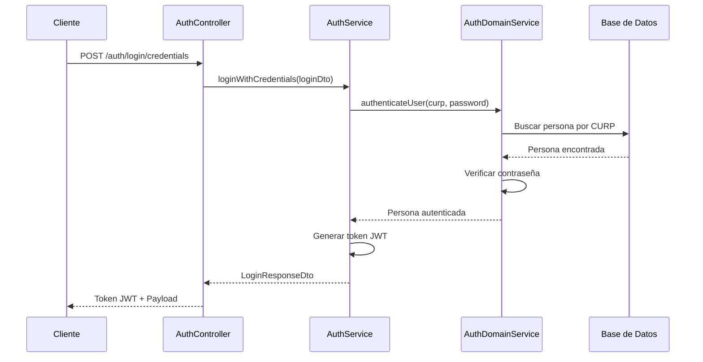
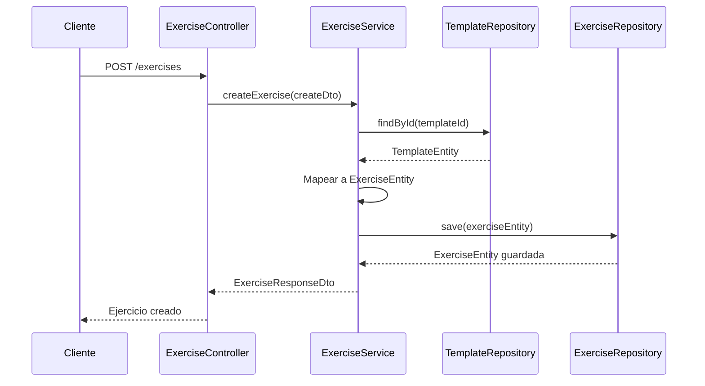
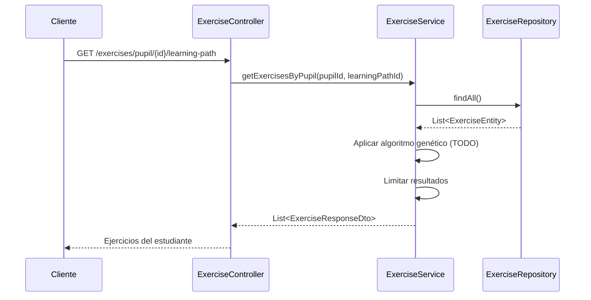
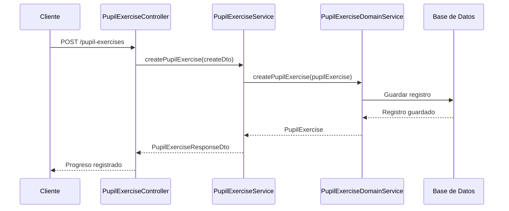

# AprendIA API - Análisis Completo del Flujo del Programa

## 📋 Resumen Ejecutivo

**AprendIA** es una **API REST** desarrollada con **Spring Boot 3.x** y **Java 21** que implementa un **sistema de aprendizaje educativo adaptativo** con **arquitectura hexagonal (Clean Architecture)**. El sistema está diseñado para gestionar contenido educativo estructurado, ejercicios personalizados, rutas de aprendizaje y seguimiento del progreso de estudiantes con **36 entidades** distribuidas en **8 módulos principales**.

---

## 🏗️ Arquitectura del Sistema

### **Patrón Arquitectónico: Hexagonal (Clean Architecture)**

```
┌─────────────────────────────────────────────────────────────┐
│                    CAPA DE PRESENTACIÓN                    │
│  ┌─────────────┐ ┌─────────────┐ ┌─────────────┐          │
│  │ Controllers │ │    DTOs     │ │   Swagger   │          │
│  └─────────────┘ └─────────────┘ └─────────────┘          │
└─────────────────────────────────────────────────────────────┘
                              │
┌─────────────────────────────────────────────────────────────┐
│                    CAPA DE APLICACIÓN                      │
│  ┌─────────────┐ ┌─────────────┐ ┌─────────────┐          │
│  │  Services   │ │   Mappers   │ │  Use Cases  │          │
│  └─────────────┘ └─────────────┘ └─────────────┘          │
└─────────────────────────────────────────────────────────────┘
                              │
┌─────────────────────────────────────────────────────────────┐
│                     CAPA DE DOMINIO                        │
│  ┌─────────────┐ ┌─────────────┐ ┌─────────────┐          │
│  │  Entities   │ │ Value Objects│ │ Repositories│          │
│  └─────────────┘ └─────────────┘ └─────────────┘          │
└─────────────────────────────────────────────────────────────┘
                              │
┌─────────────────────────────────────────────────────────────┐
│                   CAPA DE INFRAESTRUCTURA                  │
│  ┌─────────────┐ ┌─────────────┐ ┌─────────────┐          │
│  │  Entities   │ │ Repositories│ │   Database  │          │
│  └─────────────┘ └─────────────┘ └─────────────┘          │
└─────────────────────────────────────────────────────────────┘
```

---

## 🎯 Módulos del Sistema

### **1. Módulo de Autenticación (`auth/`)**

#### **Controlador: AuthController**
- **Endpoint Base**: `/auth`
- **Funcionalidades**:
  - `POST /login/credentials` - Login con CURP y contraseña
  - `POST /login/qr` - Login con código QR encriptado
  - `POST /validate-token` - Validación de tokens JWT

#### **Servicios**:
- **AuthServiceImpl**: Orquestación de autenticación
- **AuthDomainServiceImpl**: Lógica de negocio pura

#### **Entidades de Dominio**:
- **PersonaEntity** (`persona`): Información completa del usuario (CURP, datos demográficos)
- **RolEntity** (`rol`): Roles del sistema (Educador, Administrador, Coordinador, Estudiante)
- **PersonaRolEntity** (`persona_rol`): Relación many-to-many entre personas y roles

#### **Value Objects**:
- **CURP**: Validación específica de CURP mexicano
- **Password**: Manejo seguro de contraseñas con encriptación

#### **Relaciones**:
```
Persona (1) ──→ (N) PersonaRol (N) ──→ (1) Rol
```

---

### **2. Módulo de Ejercicios (`exercises/exercises/`)**

#### **Controlador: ExerciseController**
- **Endpoint Base**: `/exercises`
- **Funcionalidades**:
  - `POST /` - Crear nuevo ejercicio
  - `GET /` - Obtener todos los ejercicios
  - `GET /{id}` - Obtener ejercicio específico
  - `GET /porcentage` - Obtener porcentaje por ID y habilidad
  - `GET /pupil/{id}/learning-path` - Ejercicios por estudiante y ruta
  - `GET /templates/{id}` - Ejercicio aleatorio por plantilla

#### **Servicio: ExerciseServiceImpl**
- **Lógica de Negocio**:
  - Creación de ejercicios basados en plantillas
  - Cálculo de porcentajes por habilidad
  - **Algoritmo genético** (pendiente de implementación) para selección de ejercicios
  - Obtención de ejercicios aleatorios por plantilla

#### **Entidades**:
- **ExerciseEntity** (`ejercicio`): Ejercicios con contexto JSONB dinámico
  - `id`: Identificador único
  - `context`: Contexto del ejercicio (JSONB)
  - `template`: Relación con TemplateEntity

#### **Relaciones**:
```
Template (1) ──→ (N) Exercise
```

---

### **3. Módulo de Temas (`topics/`)**

#### **Controlador: TopicController**
- **Endpoint Base**: `/api/topics`
- **Funcionalidades**:
  - `POST /` - Crear nuevo tema
  - `GET /` - Obtener todos los temas
  - `GET /pupils/{id}/learning-path` - Temas por alumno y ruta
  - `GET /pupils/{id}` - Temas por alumno
  - `GET /{id}/learning-path` - Ruta de aprendizaje por tema

#### **Servicio: TopicServiceImpl**
- **Lógica de Negocio**:
  - Gestión de temas organizados por unidades
  - Obtención de temas por estudiante y ruta de aprendizaje
  - Gestión de rutas de aprendizaje (pendiente de implementación completa)

#### **Entidades**:
- **TopicEntity**: Temas organizados por unidades
- **UnitEntity**: Unidades de aprendizaje
- **LearningPathEntity**: Rutas de aprendizaje estructuradas

---

### **4. Módulo de Plantillas (`templates/`)**

#### **Controlador: TemplateController**
- **Endpoint Base**: `/api/templates`
- **Funcionalidades**:
  - `POST /` - Crear nueva plantilla
  - `GET /` - Obtener todas las plantillas
  - `POST /topics` - Obtener plantillas por temas
  - `GET /topic/{id}` - Plantillas por tema específico
  - `GET /{id}` - Plantilla por ID

#### **Servicio: TemplateServiceImpl**
- **Lógica de Negocio**:
  - Creación de plantillas con instrucciones y tiempo sugerido
  - Obtención de plantillas por temas específicos
  - Gestión de relaciones con layouts y temas

#### **Entidades**:
- **TemplateEntity**: Plantillas con instrucciones y tiempo sugerido
- **SkillEntity**: Habilidades evaluables
- **TemplateSkillEntity**: Relación entre plantillas y habilidades con porcentajes

---

### **5. Módulo de Layouts (`layouts/`)**

#### **Controlador: LayoutController**
- **Endpoint Base**: `/api/layouts`
- **Funcionalidades**:
  - `POST /` - Crear nuevo layout
  - `GET /` - Obtener todos los layouts

#### **Servicio: LayoutServiceImpl**
- **Lógica de Negocio**:
  - Gestión de estructuras visuales configurables
  - Atributos JSONB para personalización dinámica

#### **Entidades**:
- **LayoutEntity**: Estructuras visuales con atributos JSONB
- **TypeLayoutEntity**: Tipos de layouts (recurso, reactivo)

---

### **6. Módulo de Recursos (`resources/`)**

#### **Controlador: ResourceController**
- **Endpoint Base**: `/api/resources`
- **Funcionalidades**:
  - `POST /` - Crear nuevo recurso
  - `GET /` - Obtener todos los recursos
  - `GET /pupils/{id}/learning-path` - Recursos por alumno y ruta
  - `GET /pupils/{id}` - Recursos por alumno
  - `GET /topic/{id}/learning-path` - Recursos por tema
  - `GET /{id}` - Recurso por ID

#### **Servicio: ResourceServiceImpl**
- **Lógica de Negocio**:
  - Gestión de recursos multimedia
  - Obtención de recursos por estudiante y ruta de aprendizaje
  - Gestión de relaciones con temas y layouts

#### **Entidades**:
- **ResourceEntity**: Recursos multimedia con contenido JSONB
- **TopicResourceEntity**: Relación many-to-many entre temas y recursos

---

### **7. Módulo de Registros (`records/`)**

#### **Controlador: PupilExerciseController**
- **Endpoint Base**: `/api/pupil-exercises`
- **Funcionalidades**:
  - `POST /` - Registrar ejercicio completado
  - `GET /pupils/{id}/ids` - IDs de ejercicios por alumno
  - `GET /pupils/{id}/exercises/assigned` - Ejercicios asignados
  - `GET /pupils/{id}` - Ejercicios por alumno
  - `GET /exercises/{id}` - Ejercicios por ID de ejercicio
  - `PATCH /{id}` - Actualizar ejercicio asignado

#### **Servicio: PupilExerciseServiceImpl**
- **Lógica de Negocio**:
  - Registro de ejercicios completados por estudiantes
  - Seguimiento del progreso individual
  - Gestión de ejercicios asignados por profesores

#### **Entidades**:
- **PupilExerciseEntity**: Registros de ejercicios de estudiantes
- **PupilSkillEntity**: Habilidades desarrolladas por estudiantes
- **PupilTopicEntity**: Progreso en temas por estudiante

---

### **8. Módulo de Preferencias (`preferences/`)**

#### **Controlador: OccupationController**
- **Endpoint Base**: `/api/occupations`
- **Funcionalidades**:
  - `POST /` - Crear ocupación
  - `GET /` - Listar ocupaciones
  - `GET /{id}` - Buscar por ID
  - `GET /search` - Buscar por nombre
  - `DELETE /{id}` - Eliminar ocupación
  - `GET /exists` - Verificar existencia

#### **Controlador: PreferencesController**
- **Endpoint Base**: `/api/preferences`
- **Funcionalidades**:
  - `GET /student-impairments/students/{id}/details` - Preferencias de alumno

#### **Servicio: OccupationServiceImpl**
- **Lógica de Negocio**:
  - Gestión de ocupaciones y perfiles profesionales
  - Búsqueda y validación de ocupaciones
  - Conteo de estudiantes asociados

#### **Entidades**:
- **OccupationEntity**: Ocupaciones y perfiles profesionales
- **StudentImpairmentEntity**: Preferencias y discapacidades de estudiantes

---

## 🗂️ Mapa Completo de Entidades y Relaciones

### **Entidades Principales (26 entidades implementadas)**

#### **Módulo de Autenticación (3 entidades)**
1. **PersonaEntity** (`persona`) - Información personal de usuarios
   - Campos: CURP, nombres, apellidos, fecha nacimiento, género, dirección
   - Relación: One-to-Many con PersonaRolEntity
2. **RolEntity** (`rol`) - Roles del sistema
3. **PersonaRolEntity** (`persona_rol`) - Relación many-to-many

#### **Módulo de Ejercicios (1 entidad)**
4. **ExerciseEntity** (`ejercicio`) - Ejercicios con contexto JSONB
   - Campo `contexto`: JSONB para contenido dinámico
   - Relación: Many-to-One con TemplateEntity

#### **Módulo de Plantillas (2 entidades)**
5. **TemplateEntity** (`plantilla`) - Plantillas reutilizables
   - Campos: título, instrucciones, tiempo sugerido
   - Relaciones: Many-to-One con TopicEntity y LayoutEntity
6. **SkillEntity** (`habilidad`) - Habilidades evaluables

#### **Módulo de Layouts (2 entidades)**
7. **LayoutEntity** (`layout`) - Estructuras visuales
8. **TypeLayoutEntity** (`tipo_layouts`) - Tipos de layouts

#### **Módulo de Temas (4 entidades)**
9. **TopicEntity** (`tema`) - Temas organizados por unidades
   - Relaciones: Many-to-One con UnitEntity, One-to-Many con TemplateEntity
10. **UnitEntity** (`unidad`) - Unidades de aprendizaje
11. **ResourceEntity** (`recurso`) - Recursos multimedia
12. **TopicSequenceEntity** (`secuencia_temas`) - Secuencias de temas

#### **Módulo de Registros (3 entidades)**
13. **PupilExerciseEntity** (`educando_ejercicios`) - Ejercicios de estudiantes
    - Campos: fechas de asignación/completado, tiempo asignado, por educador
    - Relación: One-to-Many con PupilSkillEntity
14. **PupilSkillEntity** (`educando_ejercicio_habilidades`) - Habilidades de estudiantes
15. **PupilTopicEntity** (`educando_temas`) - Temas de estudiantes

#### **Módulo de Preferencias - Ocupaciones (3 entidades)**
16. **OccupationEntity** (`ocupacion`) - Ocupaciones y perfiles
17. **StudentOccupationEntity** (`estudiante_ocupacion`) - Relación estudiante-ocupación
18. **ExerciseOccupationEntity** (`ejercicio_ocupacion`) - Relación ejercicio-ocupación

#### **Módulo de Preferencias - Regiones (4 entidades)**
19. **RegionEntity** (`region`) - Regiones geográficas
20. **StudentRegionEntity** (`estudiante_region`) - Relación estudiante-región
21. **ExerciseRegionEntity** (`ejercicio_region`) - Relación ejercicio-región
22. **WordRegionEntity** (`region_palabras`) - Relación palabra-región

#### **Módulo de Preferencias - Palabras (3 entidades)**
23. **WordEntity** (`palabra`) - Palabras del vocabulario
    - Relaciones: One-to-Many con WordMeaningEntity y WordOccupationEntity
24. **WordMeaningEntity** (`palabra_significado`) - Significados de palabras
25. **WordOccupationEntity** (`palabra_ocupacion`) - Relación palabra-ocupación

#### **Módulo de Instrucciones (1 entidad)**
26. **TypeInstructionMediaEntity** (`tipo_instruccion_media`) - Tipos de instrucciones

### **Diagrama de Relaciones Principales (Implementadas)**

```
                    PERSONA (1) ──→ (N) PERSONA_ROL (N) ──→ (1) ROL
                                                                    │
                    UNIT (1) ──→ (N) TOPIC (N) ──→ (N) RESOURCE     │
                         │              │              │            │
                         │              │              │            │
                    TOPIC_SEQUENCE (N) ──→ (1) TOPIC                │
                         │              │              │            │
                         │              │              │            │
                    TEMPLATE (1) ──→ (N) EXERCISE (N) ──→ (1) PUPIL_EXERCISE
                         │              │              │            │
                         │              │              │            │
                    LAYOUT (1) ──→ (N) TEMPLATE        │            │
                         │              │              │            │
                         │              │              │            │
                    SKILL (1) ──→ (N) PUPIL_SKILL      │            │
                                                       │            │
                    PUPIL_SKILL ──→ (1) PUPIL_EXERCISE ──→ (1) PERSONA
```

### **Relaciones Implementadas vs Documentadas**

#### **✅ Relaciones Implementadas:**
- **Persona ↔ PersonaRol ↔ Rol**: Many-to-Many implementada
- **Unit → Topic**: One-to-Many implementada
- **Topic → Template**: One-to-Many implementada
- **Template → Exercise**: One-to-Many implementada
- **Layout → Template**: One-to-Many implementada
- **PupilExercise → PupilSkill**: One-to-Many implementada

#### **❌ Relaciones No Implementadas (Faltantes):**
- **LearningPath**: No se encontró entidad implementada
- **TopicResource**: Relación tema-recurso no implementada
- **TemplateSkill**: Relación plantilla-habilidad no implementada
- **TemplateInstructionMedia**: Relación plantilla-instrucción no implementada
- **PupilTopic**: Relación estudiante-tema no implementada
- **Occupation/Region/Word**: Relaciones de preferencias no implementadas

---

## 🎮 Controladores y Endpoints Completos (20 Controladores Implementados)

### **Módulo de Autenticación**
- **AuthController** (`/auth`)
  - `POST /login/credentials` - Login con CURP y contraseña
  - `POST /login/qr` - Login con código QR encriptado
  - `POST /validate-token` - Validación de tokens JWT

### **Módulo de Ejercicios**
- **ExerciseController** (`/exercises`)
  - `POST /` - Crear nuevo ejercicio
  - `GET /` - Obtener todos los ejercicios
  - `GET /{id}` - Obtener ejercicio específico
  - `GET /porcentage` - Obtener porcentaje por ID y habilidad
  - `GET /pupil/{id}/learning-path` - Ejercicios por estudiante y ruta
  - `GET /templates/{id}` - Ejercicio aleatorio por plantilla

### **Módulo de Temas**
- **TopicController** (`/api/topics`)
  - `POST /` - Crear nuevo tema
  - `GET /` - Obtener todos los temas
  - `GET /pupils/{id}/learning-path` - Temas por alumno y ruta
  - `GET /pupils/{id}` - Temas por alumno
  - `GET /{id}/learning-path` - Ruta de aprendizaje por tema

- **UnitController** (`/units`)
  - `POST /` - Crear unidad
  - `GET /` - Obtener todas las unidades

- **ResourceController** (`/api/resources`)
  - `POST /` - Crear nuevo recurso
  - `GET /` - Obtener todos los recursos
  - `GET /pupils/{id}/learning-path` - Recursos por alumno y ruta
  - `GET /pupils/{id}` - Recursos por alumno
  - `GET /topic/{id}/learning-path` - Recursos por tema
  - `GET /topic/{id}/learning-path/{learningPathId}` - Recursos por tema y ruta
  - `GET /{id}` - Recurso por ID

- **TopicSequenceController** (`/topics-sequences`)
- **TopicResourceController** (`/topic-resource`)

### **Módulo de Plantillas**
- **TemplateController** (`/templates`)
  - `POST /` - Crear nueva plantilla
  - `GET /` - Obtener todas las plantillas
  - `POST /topics` - Obtener plantillas por temas
  - `GET /topic/{id}` - Plantillas por tema específico
  - `GET /{id}` - Plantilla por ID

- **SkillController** (`/skills`)
  - `POST /` - Crear skill
  - `GET /` - Obtener todas las skills
  - `POST /templates` - Obtener skills por templates

- **TemplateSkillController** (`/api/templates-skills`)
- **TemplateInstructionMediaController** (`/api/templates-instructions-medias`)
- **TypeInstructionMediaController** (`/api/instructions-medias-types`)

### **Módulo de Layouts**
- **LayoutController** (`/layouts`)
  - `POST /` - Crear nuevo layout
  - `GET /` - Obtener todos los layouts

- **TypeLayoutController** (`/layouts-types`)
  - `POST /` - Crear tipo de layout
  - `GET /` - Obtener tipos de layout

### **Módulo de Registros**
- **PupilExerciseController** (`/pupil-exercises`)
  - `POST /` - Registrar ejercicio completado
  - `GET /pupils/{id}/ids` - IDs de ejercicios por alumno
  - `GET /pupils/{id}/exercises/assigned` - Ejercicios asignados
  - `GET /pupils/{id}` - Ejercicios por alumno
  - `GET /exercises/{id}` - Ejercicios por ID de ejercicio
  - `PATCH /{id}` - Actualizar ejercicio asignado

- **PupilSkillController** (`/pupil-skills`)
  - `POST /` - Crear registro de skill de alumno
  - `POST /many` - Crear múltiples registros de skills
  - `GET /` - Obtener skills de alumnos
  - `GET /pupil/{id}` - Obtener skills por alumno
  - `GET /grades/skills` - Obtener skills por grados

- **PupilTopicController** (`/pupil-topics`)

### **Módulo de Preferencias**
- **OccupationController** (`/occupations`)
  - `POST /` - Crear ocupación
  - `GET /` - Listar ocupaciones
  - `GET /{id}` - Buscar por ID
  - `GET /search` - Buscar por nombre
  - `DELETE /{id}` - Eliminar ocupación
  - `GET /exists` - Verificar existencia

- **PreferencesController** (`/preferences`)
  - `GET /student-impairments/students/{id}/details` - Preferencias de alumno

- **ExerciseOccupationController** (`/preferences/exercise-occupations`)

---

## ⚙️ Servicios y Lógica de Negocio

### **Servicios de Aplicación (22 servicios)**

#### **Módulo de Autenticación**
- **AuthServiceImpl**: Orquestación de autenticación
- **AuthDomainServiceImpl**: Lógica de negocio pura de autenticación

#### **Módulo de Ejercicios**
- **ExerciseServiceImpl**: Gestión de ejercicios y algoritmos genéticos

#### **Módulo de Temas**
- **TopicServiceImpl**: Gestión de temas y rutas de aprendizaje
- **UnitServiceImpl**: Gestión de unidades de aprendizaje
- **ResourceServiceImpl**: Gestión de recursos multimedia
- **TopicSequenceServiceImpl**: Gestión de secuencias de temas
- **TopicResourceServiceImpl**: Gestión de relaciones tema-recurso

#### **Módulo de Plantillas**
- **TemplateServiceImpl**: Gestión de plantillas reutilizables
- **SkillServiceImpl**: Gestión de habilidades evaluables
- **TemplateSkillServiceImpl**: Gestión de relaciones plantilla-habilidad
- **TemplateInstructionMediaServiceImpl**: Gestión de instrucciones multimedia
- **TypeInstructionMediaServiceImpl**: Gestión de tipos de instrucciones

#### **Módulo de Layouts**
- **LayoutServiceImpl**: Gestión de estructuras visuales
- **TypeLayoutServiceImpl**: Gestión de tipos de layouts

#### **Módulo de Registros**
- **PupilExerciseServiceImpl**: Gestión de ejercicios de estudiantes
- **PupilSkillServiceImpl**: Gestión de habilidades de estudiantes
- **PupilTopicServiceImpl**: Gestión de temas de estudiantes
- **PupilExerciseDomainServiceImpl**: Lógica de negocio de registros

#### **Módulo de Preferencias**
- **OccupationServiceImpl**: Gestión de ocupaciones y perfiles
- **ExerciseOccupationServiceImpl**: Gestión de relaciones ejercicio-ocupación
- **StudentImpairmentServiceImpl**: Gestión de discapacidades de estudiantes

### **Patrones de Diseño Implementados**

#### **Arquitectura Hexagonal (Clean Architecture)**
- **Capa de Dominio**: Entidades puras con lógica de negocio
- **Capa de Aplicación**: Servicios que orquestan casos de uso
- **Capa de Infraestructura**: Repositorios y entidades JPA
- **Capa de Presentación**: Controladores REST

#### **Domain-Driven Design (DDD)**
- **Value Objects**: CURP, Password con validaciones específicas
- **Domain Services**: Lógica de negocio compleja
- **Aggregates**: Persona, Exercise, Template como agregados raíz
- **Repositories**: Interfaces para abstracción de persistencia

#### **Patrones de Diseño**
- **Repository Pattern**: Abstracción de acceso a datos
- **Service Layer**: Separación de lógica de negocio
- **Builder Pattern**: Construcción de entidades complejas
- **Mapper Pattern**: Conversión entre capas
- **Strategy Pattern**: Diferentes algoritmos de selección de ejercicios

---

## 🔄 Flujos Principales del Sistema

### **1. Flujo de Autenticación**



### **2. Flujo de Creación de Ejercicio**



### **3. Flujo de Obtención de Ejercicios por Estudiante**



### **4. Flujo de Registro de Progreso**



---

## 🎯 Casos de Uso Principales

### **1. Estudiante Realizando Ejercicio**

1. **Autenticación**: Estudiante se autentica con CURP/password o QR
2. **Obtención de Ejercicios**: Sistema obtiene ejercicios personalizados según ruta de aprendizaje
3. **Realización**: Estudiante completa el ejercicio
4. **Registro**: Sistema registra el progreso y resultados
5. **Actualización**: Se actualiza el perfil de habilidades del estudiante

### **2. Educador Creando Contenido**

1. **Autenticación**: Educador se autentica con credenciales
2. **Creación de Tema**: Crea nuevo tema en una unidad
3. **Creación de Plantilla**: Crea plantilla con instrucciones y layout
4. **Creación de Ejercicio**: Genera ejercicios basados en la plantilla
5. **Asignación**: Asigna ejercicios a estudiantes específicos

### **3. Sistema de Aprendizaje Adaptativo**

1. **Análisis de Progreso**: Sistema analiza el progreso del estudiante
2. **Selección de Contenido**: Algoritmo genético selecciona ejercicios apropiados
3. **Personalización**: Contenido se adapta a las necesidades del estudiante
4. **Seguimiento**: Sistema registra y analiza el rendimiento

---

## 🔧 Tecnologías y Patrones Implementados

### **Backend**
- **Spring Boot 3.x** con Java 21
- **JPA/Hibernate** para mapeo objeto-relacional
- **PostgreSQL** con soporte JSONB
- **JWT** para autenticación
- **Swagger/OpenAPI** para documentación

### **Patrones de Diseño**
- **Arquitectura Hexagonal** (Clean Architecture)
- **Domain-Driven Design** (DDD)
- **Repository Pattern** para abstracción de datos
- **Service Layer** para lógica de negocio
- **Builder Pattern** en entidades de dominio
- **Mapper Pattern** para conversión entre capas

### **Características Técnicas**
- **Value Objects** para validaciones específicas (CURP, Password)
- **JSONB** para contenido dinámico y configuraciones
- **Exception Handling** específico del dominio
- **Logging** estructurado con SLF4J
- **Testing** con JUnit y mocks

---

## 📊 Estado de Implementación

### **✅ Completado**
- **Autenticación con JWT**: Login con credenciales, QR y validación de tokens
- **CRUD básico**: Todas las entidades principales tienen operaciones básicas
- **Controladores implementados**: 20 controladores con endpoints funcionales
- **Servicios de aplicación**: 22 servicios implementados con lógica básica
- **Documentación con Swagger**: Todos los endpoints documentados
- **Arquitectura hexagonal**: Implementada correctamente con separación de capas
- **Manejo de excepciones**: Excepciones específicas del dominio implementadas
- **Mappers**: Conversión entre capas implementada
- **Endpoints totales**: 71 endpoints implementados en 20 controladores

### **🚧 En Desarrollo (TODOs Identificados)**

#### **Módulo de Ejercicios**
- **Algoritmo genético**: `ExerciseServiceImpl.getExercisesByPupil()` - Línea 74
  - Actualmente retorna ejercicios limitados, falta implementar algoritmo genético real

#### **Módulo de Temas**
- **Lógica específica por alumno**: `TopicServiceImpl` - Líneas 54, 61, 68
  - `getTopicsByPupilLearningPath()` - Retorna todos los temas
  - `getTopicsByPupil()` - Retorna todos los temas
  - `getLearningPathByTopic()` - Lógica pendiente

#### **Módulo de Recursos**
- **Lógica específica por alumno**: `ResourceServiceImpl` - Líneas 46, 53, 60, 67
  - `getResourcesByPupilLearningPath()` - Retorna todos los recursos
  - `getResourcesByTopicLearningPath()` - Retorna todos los recursos
  - `getResourcesByPupil()` - Retorna todos los recursos
  - `getResourcesByTopic()` - Retorna todos los recursos

#### **Módulo de Layouts**
- **Relación con TypeLayout**: `LayoutServiceImpl` - Línea 26
  - Falta implementar relación con TypeLayout en la entidad

#### **Módulo de Plantillas**
- **Atributos dinámicos**: `TemplateServiceImpl` - Línea 95
  - Falta implementar atributos cuando esté disponible en la entidad

#### **Módulo de Registros**
- **Lógica de ejercicios asignados**: `PupilExerciseServiceImpl` - Línea 45
  - `getAssignedExercisesByPupil()` - Retorna lista vacía
- **Lógica de actualización**: `PupilExerciseServiceImpl` - Línea 64
  - Falta implementar lógica de actualización
- **Mappers con datos reales**: `PupilExerciseMapper` - Líneas 76, 78, 85
  - Nombres hardcodeados, falta obtener nombres reales
  - Lógica de asignación por profesor pendiente

#### **Módulo de Preferencias**
- **Mappers con datos reales**: `StudentImpairmentMapper` - Líneas 32, 40
  - Nombres hardcodeados, falta obtener nombres reales
  - Mapeo de ruta de aprendizaje pendiente
- **Funcionalidad de conteo**: `OccupationRepository` - Línea 51
  - Método de conteo de estudiantes pendiente

### **📋 Pendiente (No Implementado)**
- **Sistema de notificaciones**: No hay controladores ni servicios
- **Reportes y analytics**: No hay módulo de reportes
- **Optimización de consultas**: Consultas básicas implementadas
- **Cache distribuido**: No implementado
- **Monitoreo y métricas**: No implementado
- **Tests de integración**: Solo tests unitarios básicos
- **Validaciones avanzadas**: Validaciones básicas implementadas
- **Paginación**: No implementada en endpoints
- **Filtros avanzados**: Filtros básicos implementados

---